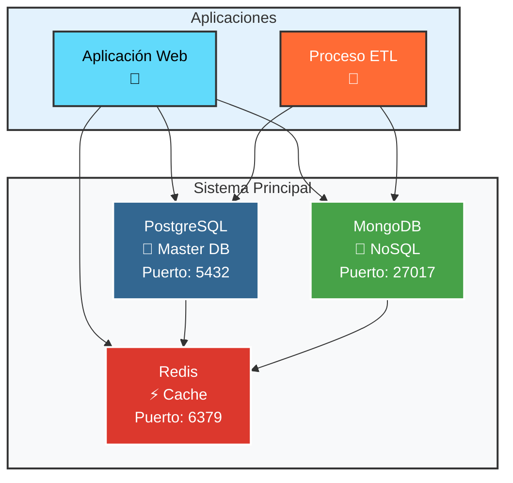

```mermaid
flowchart TD
    subgraph Main["Sistema Principal"]
        PG["PostgreSQL<br/>🐘 Master DB<br/>Puerto: 5432"]
        Redis["Redis<br/>⚡ Cache<br/>Puerto: 6379"]
        Mongo["MongoDB<br/>🍃 NoSQL<br/>Puerto: 27017"]
    end
    
    subgraph Apps["Aplicaciones"]
        WebApp["Aplicación Web<br/>📱"]
        ETL["Proceso ETL<br/>🔄"]
    end
    
    %% Conexiones principales
    WebApp --> PG
    WebApp --> Redis
    WebApp --> Mongo
    
    %% ETL connections
    ETL --> PG
    ETL --> Mongo
    
    %% Cache connections
    PG --> Redis
    Mongo --> Redis
    
    %% Styling
    style PG fill:#336791,stroke:#fff,stroke-width:2px,color:#fff
    style Redis fill:#dc382d,stroke:#fff,stroke-width:2px,color:#fff
    style Mongo fill:#47a248,stroke:#fff,stroke-width:2px,color:#fff
    style WebApp fill:#61dafb,stroke:#333,stroke-width:2px,color:#000
    style ETL fill:#ff6b35,stroke:#333,stroke-width:2px,color:#fff
    style Main fill:#f8f9fa,stroke:#333,stroke-width:2px
    style Apps fill:#e3f2fd,stroke:#333,stroke-width:2px
```