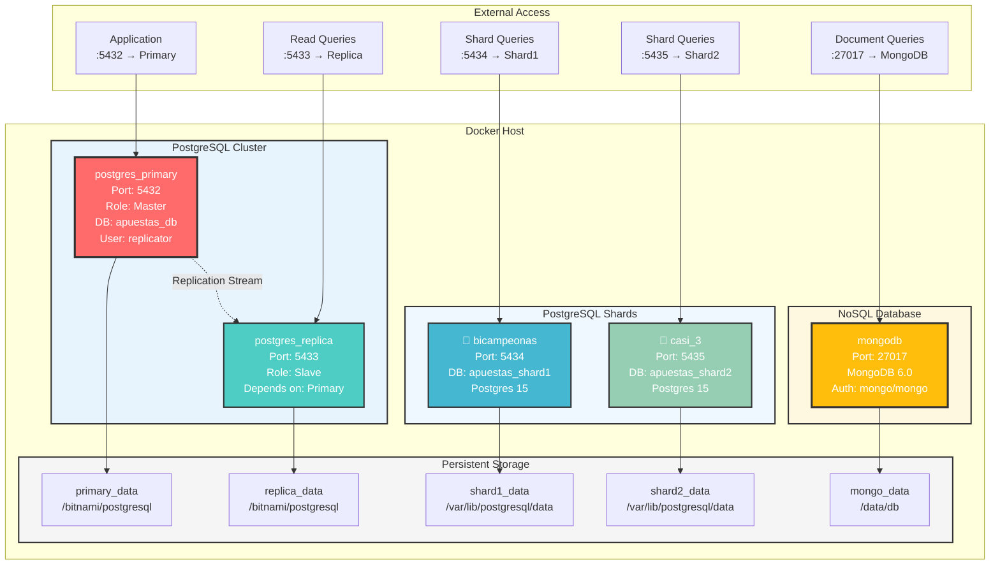

```mermaid
flowchart TD
    subgraph DockerHost["Docker Host"]

        subgraph PostgreSQL["PostgreSQL Cluster"]
            Primary["postgres_primary<br/>Port: 5432<br/>Role: Master<br/>DB: apuestas_db<br/>User: replicator"]
            Replica["postgres_replica<br/>Port: 5433<br/>Role: Slave<br/>Depends on: Primary"]

            Primary -.->|"Replication Stream"| Replica
        end

        subgraph Sharding["PostgreSQL Shards"]
            Shard1["🔸 bicampeonas<br/>Port: 5434<br/>DB: apuestas_shard1<br/>Postgres 15"]
            Shard2["🔹 casi_3<br/>Port: 5435<br/>DB: apuestas_shard2<br/>Postgres 15"]
        end

        subgraph NoSQL["NoSQL Database"]
            MongoDB["mongodb<br/>Port: 27017<br/>MongoDB 6.0<br/>Auth: mongo/mongo"]
        end

        subgraph Storage["Persistent Storage"]
            PrimaryVol["primary_data<br/>/bitnami/postgresql"]
            ReplicaVol["replica_data<br/>/bitnami/postgresql"]
            Shard1Vol["shard1_data<br/>/var/lib/postgresql/data"]
            Shard2Vol["shard2_data<br/>/var/lib/postgresql/data"]
            MongoVol["mongo_data<br/>/data/db"]
        end
    end

    subgraph ExternalAccess["External Access"]
        App1["Application<br/>:5432 → Primary"]
        App2["Read Queries<br/>:5433 → Replica"]
        App3["Shard Queries<br/>:5434 → Shard1"]
        App4["Shard Queries<br/>:5435 → Shard2"]
        App5["Document Queries<br/>:27017 → MongoDB"]
    end

    Primary --> PrimaryVol
    Replica --> ReplicaVol
    Shard1 --> Shard1Vol
    Shard2 --> Shard2Vol
    MongoDB --> MongoVol

    App1 --> Primary
    App2 --> Replica
    App3 --> Shard1
    App4 --> Shard2
    App5 --> MongoDB

    style Primary fill:#ff6b6b,stroke:#333,stroke-width:3px,color:#fff
    style Replica fill:#4ecdc4,stroke:#333,stroke-width:2px,color:#fff
    style Shard1 fill:#45b7d1,stroke:#333,stroke-width:2px,color:#fff
    style Shard2 fill:#96ceb4,stroke:#333,stroke-width:2px,color:#fff
    style MongoDB fill:#ffbe0b,stroke:#333,stroke-width:3px,color:#fff
    style PostgreSQL fill:#e8f4fd,stroke:#333,stroke-width:2px
    style Sharding fill:#f0f8ff,stroke:#333,stroke-width:2px
    style NoSQL fill:#fff8e1,stroke:#333,stroke-width:2px
    style Storage fill:#f5f5f5,stroke:#333,stroke-width:2px
```
