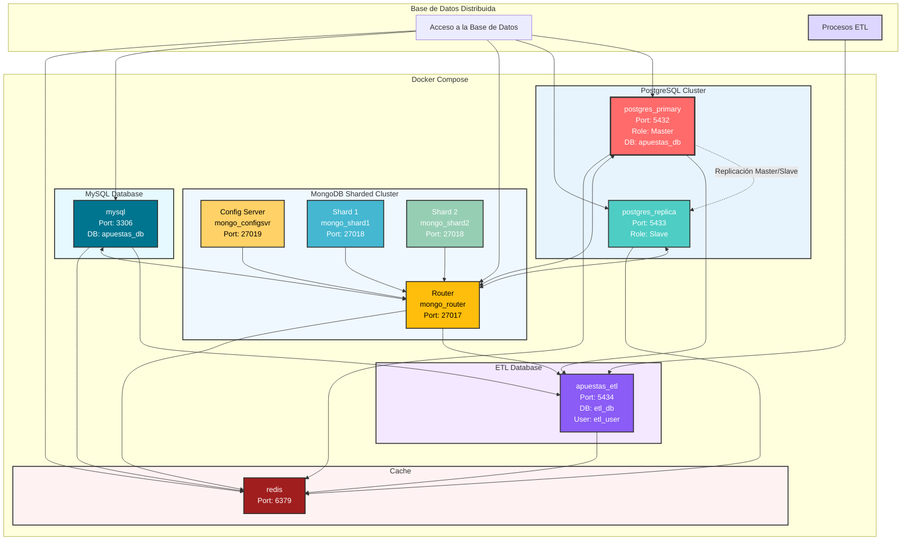

```mermaid
flowchart TD
    subgraph DockerHost["Docker Compose"]
        subgraph PostgreSQL["PostgreSQL Cluster"]
            Primary["postgres_primary<br/>Port: 5432<br/>Role: Master<br/>DB: apuestas_db"]
            Replica["postgres_replica<br/>Port: 5433<br/>Role: Slave"]
            Primary -.->|"Replicación Master/Slave"| Replica
        end
        
        subgraph ETL["ETL Database"]
            ETLDB["apuestas_etl<br/>Port: 5434<br/>DB: etl_db<br/>User: etl_user"]
        end
        
        subgraph MMySQL["MySQL Database"]
            MySQL["mysql<br/>Port: 3306<br/>DB: apuestas_db"]
        end
        
        subgraph MongoDB["MongoDB Sharded Cluster"]
            ConfigSvr["Config Server<br/>mongo_configsvr<br/>Port: 27019"]
            Shard1["Shard 1<br/>mongo_shard1<br/>Port: 27018"]
            Shard2["Shard 2<br/>mongo_shard2<br/>Port: 27018"]
            Mongos["Router<br/>mongo_router<br/>Port: 27017"]
            ConfigSvr --> Mongos
            Shard1 --> Mongos
            Shard2 --> Mongos
        end
        
        subgraph Cache["Cache"]
            Redis["redis<br/>Port: 6379"]
        end
    end
    
    subgraph ExternalAccess["Base de Datos Distribuida"]
        App1["Acceso a la Base de Datos"]
        ETLProcess["Procesos ETL"]
    end
    
    %% ETL Process flows
    Primary --> ETLDB
    MySQL --> ETLDB
    Mongos --> ETLDB
    
    %% ETL external access
    ETLProcess --> ETLDB
    
    %% Database Interconnections
    Primary <--> Mongos
    MySQL <--> Mongos
    Replica <--> Mongos
    
    %% Redis caching from all databases
    Primary --> Redis
    Replica --> Redis
    MySQL --> Redis
    Mongos --> Redis
    ETLDB --> Redis
    
    %% External access
    App1 --> Primary
    App1 --> Replica
    App1 --> Mongos
    App1 --> MySQL
    App1 --> Redis
    
    %% Styling
    style Primary fill:#ff6b6b,stroke:#333,stroke-width:3px,color:#fff
    style Replica fill:#4ecdc4,stroke:#333,stroke-width:2px,color:#fff
    style MySQL fill:#00758f,stroke:#333,stroke-width:2px,color:#fff
    style Redis fill:#a11e1e,stroke:#333,stroke-width:2px,color:#fff
    style Mongos fill:#ffbe0b,stroke:#333,stroke-width:2px,color:#000
    style Shard1 fill:#45b7d1,stroke:#333,stroke-width:2px,color:#fff
    style Shard2 fill:#96ceb4,stroke:#333,stroke-width:2px,color:#fff
    style ConfigSvr fill:#ffd166,stroke:#333,stroke-width:2px,color:#000
    style ETLDB fill:#8b5cf6,stroke:#333,stroke-width:2px,color:#fff
    style PostgreSQL fill:#e8f4fd,stroke:#333,stroke-width:2px
    style MongoDB fill:#f0f8ff,stroke:#333,stroke-width:2px
    style Cache fill:#fef2f2,stroke:#333,stroke-width:2px
    style MMySQL fill:#e6f9ff,stroke:#333,stroke-width:2px
    style ETL fill:#f3e8ff,stroke:#333,stroke-width:2px
    style ETLProcess fill:#ddd6fe,stroke:#333,stroke-width:2px
```