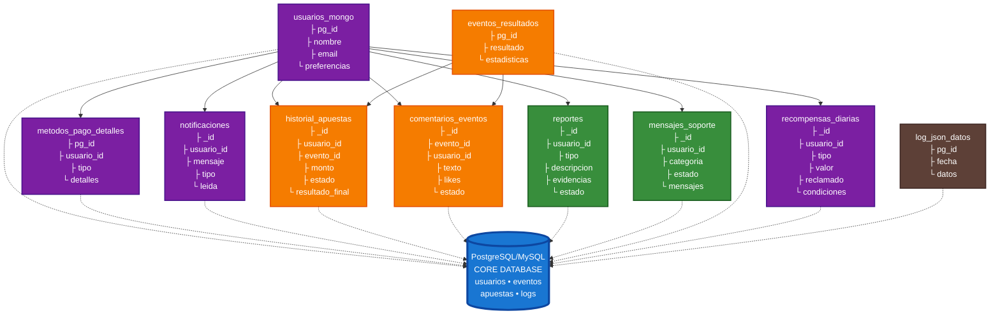

```mermaid
graph TD
    %% COLECCIONES IZQUIERDA SUPERIOR
    MPD[metodos_pago_detalles<br/>├ pg_id<br/>├ usuario_id<br/>├ tipo<br/>└ detalles]
    
    NOT[notificaciones<br/>├ _id<br/>├ usuario_id<br/>├ mensaje<br/>├ tipo<br/>└ leida]
    
    %% COLECCIONES DERECHA SUPERIOR  
    HA[historial_apuestas<br/>├ _id<br/>├ usuario_id<br/>├ evento_id<br/>├ monto<br/>├ estado<br/>└ resultado_final]
    
    CE[comentarios_eventos<br/>├ _id<br/>├ evento_id<br/>├ usuario_id<br/>├ texto<br/>├ likes<br/>└ estado]
    
    %% NÚCLEO CENTRAL
    SQL[(PostgreSQL/MySQL<br/>CORE DATABASE<br/>usuarios • eventos<br/>apuestas • logs)]
    
    %% COLECCIONES IZQUIERDA INFERIOR
    REP[reportes<br/>├ _id<br/>├ usuario_id<br/>├ tipo<br/>├ descripcion<br/>├ evidencias<br/>└ estado]
    
    MS[mensajes_soporte<br/>├ _id<br/>├ usuario_id<br/>├ categoria<br/>├ estado<br/>└ mensajes]
    
    %% COLECCIONES DERECHA INFERIOR
    ER[eventos_resultados<br/>├ pg_id<br/>├ resultado<br/>└ estadisticas]
    
    RD[recompensas_diarias<br/>├ _id<br/>├ usuario_id<br/>├ tipo<br/>├ valor<br/>├ reclamado<br/>└ condiciones]
    
    %% COLECCIONES SUPERIOR E INFERIOR
    UM[usuarios_mongo<br/>├ pg_id<br/>├ nombre<br/>├ email<br/>└ preferencias]
    
    LJD[log_json_datos<br/>├ pg_id<br/>├ fecha<br/>└ datos]
    
    %% POSICIONAMIENTO RADIAL
    UM -.-> SQL
    MPD -.-> SQL
    NOT -.-> SQL
    HA -.-> SQL
    CE -.-> SQL
    REP -.-> SQL
    MS -.-> SQL
    ER -.-> SQL
    RD -.-> SQL
    LJD -.-> SQL
    
    %% RELACIONES LÓGICAS ENTRE COLECCIONES
    UM --> NOT
    UM --> MPD
    UM --> HA
    UM --> CE
    UM --> REP
    UM --> MS
    UM --> RD
    
    ER --> HA
    ER --> CE
    
    %% ESTILOS
    classDef coreDB fill:#1976d2,color:#fff,stroke:#0d47a1,stroke-width:4px
    classDef userCol fill:#7b1fa2,color:#fff,stroke:#4a148c,stroke-width:2px
    classDef eventCol fill:#f57c00,color:#fff,stroke:#e65100,stroke-width:2px
    classDef supportCol fill:#388e3c,color:#fff,stroke:#1b5e20,stroke-width:2px
    classDef logCol fill:#5d4037,color:#fff,stroke:#3e2723,stroke-width:2px
    
    class SQL coreDB
    class UM,NOT,MPD,RD userCol
    class HA,CE,ER eventCol
    class REP,MS supportCol
    class LJD logCol
```