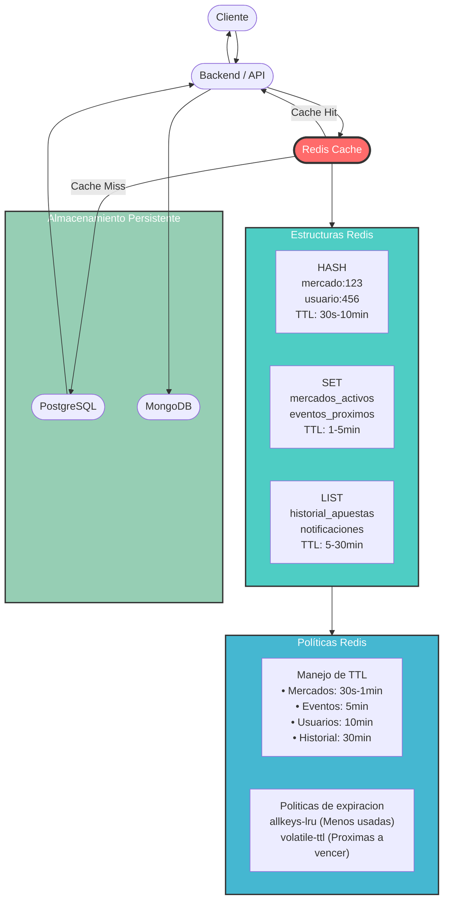

```mermaid
flowchart TD
    Cliente([Cliente])
    API([Backend / API])
    Redis([Redis Cache])
    Postgres([PostgreSQL])
    Mongo([MongoDB])
    
    Cliente --> API
    API --> Redis
    Redis -- "Cache Hit" --> API
    Redis -- "Cache Miss" --> Postgres
    Postgres --> API
    API --> Cliente
    API --> Mongo
    
    subgraph RedisStructures["Estructuras Redis"]
        Hashes["HASH<br/>mercado:123<br/>usuario:456<br/>TTL: 30s-10min"]
        Sets["SET<br/>mercados_activos<br/>eventos_proximos<br/>TTL: 1-5min"]
        Lists["LIST<br/>historial_apuestas<br/>notificaciones<br/>TTL: 5-30min"]
    end
    
    subgraph RedisPolicies["Políticas Redis"]
        TTL["Manejo de TTL<br/>• Mercados: 30s-1min<br/>• Eventos: 5min<br/>• Usuarios: 10min<br/>• Historial: 30min"]
        Eviction["Politicas de expiracion<br/>allkeys-lru (Menos usadas)<br/>volatile-ttl (Proximas a 
        vencer)<br/>"]
    end
    
    subgraph Almacenamiento["Almacenamiento Persistente"]
        Postgres 
        Mongo
    end
    
    Redis --> RedisStructures
    RedisStructures --> RedisPolicies
    
    style Redis fill:#ff6b6b,stroke:#333,stroke-width:3px,color:#fff
    style RedisStructures fill:#4ecdc4,stroke:#333,stroke-width:2px,color:#fff
    style RedisPolicies fill:#45b7d1,stroke:#333,stroke-width:2px,color:#fff
    style Almacenamiento fill:#96ceb4,stroke:#333,stroke-width:2px,color:#fff
```